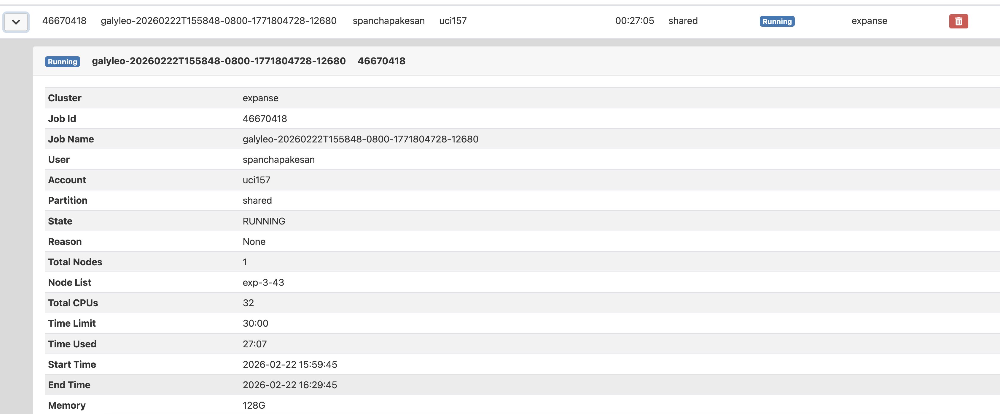

# Data Introduction

This project utilizes the NYC FHVHV Trip Dataset, curated by Jeff Sinsel
using data from the NYC Taxi and Limousine Commission (TLC), 
which contains comprehensive records of hundreds of millions of rides 
from high-volume ride-hailing service providers like Uber, Lyft, and Via 
between 2019 and 2022. The data can be found at 
https://www.kaggle.com/datasets/jeffsinsel/nyc-fhvhv-data

# SDSC Expanse Spark Setup

## Environment Overview

This project was executed on SDSC Expanse using an interactive compute
node. The dataset contains hundreds of millions of NYC FHV trip records,
so a distributed Spark setup was required to handle large shuffle
operations such as deduplication, aggregations, and feature engineering.

## Cluster Resources Requested

For large-scale preprocessing (deduplication + aggregations), the
following resources were requested:

-   Total Cores: 8
-   Total Memory: 128 GB

These resources were selected to ensure sufficient memory for wide
shuffle stages during deduplication and tipping aggregations.


## Executor Configuration

Spark was configured using the following formula:

Executor Instances = Total Cores - 1\
Executor Memory = (Total Memory - Driver Memory) / Executor Instances

Applied configuration:

-   Total Cores = 8
-   Total Memory = 128 GB
-   Driver Memory = 8 GB

Executor Instances = 8 - 1 = 7

Executor Memory = (128 - 8) / 7\
Executor Memory ≈ 17.14 GB per executor

This configuration ensures: - One core reserved for the driver -
Parallel execution across executor slots - Balanced memory distribution
for shuffle-heavy operations

## Spark UI



## SparkSession Configuration

``` python
spark = (
    SparkSession.builder
    .config("spark.local.dir", spark_tmp)
    .config("spark.driver.memory", "2g")
    .config("spark.executor.memory", "18g")
    .config('spark.executor.instances', 7)
    .config("spark.sql.shuffle.partitions", "4000")
    .getOrCreate()
)
```

### Justification

-   spark.driver.memory = 2g
    Prevents driver-side memory pressure while leaving sufficient memory
    for executors.

-   spark.sql.shuffle.partitions = 4000
    Increased from default to reduce shuffle spill during deduplication
    of hundreds of millions of rows.

-   spark.local.dir = TMPDIR
    Ensures shuffle spill occurs on high-speed scratch disk instead of
    quota-limited home directory.

## Scratch Disk Usage

Shuffle spill and temporary data were directed to:

/scratch/`<username>`{=html}/job\_`<job_id>`{=html}

This prevents disk quota errors and allows large-scale sort and shuffle
operations.


## Spark UI Verification

During large transformations such as:

-   dropDuplicates()
-   groupBy aggregations
-   Parquet write operations

Multiple executors were active concurrently.


## Why This Setup Was Necessary

The dataset contains several hundred million records.

Operations such as: - Deduplication on composite keys - Group-by tipping
aggregations - Temporal feature engineering

require wide transformations and shuffle stages.

The distributed executor configuration allowed: - Stable shuffle
performance - Reduced disk spill failures - Successful persistence of a
cleaned Parquet dataset
