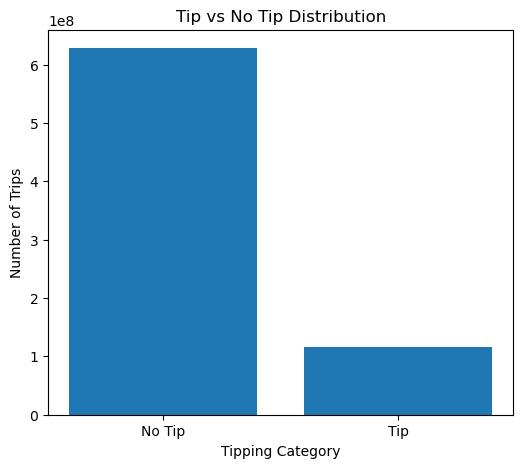
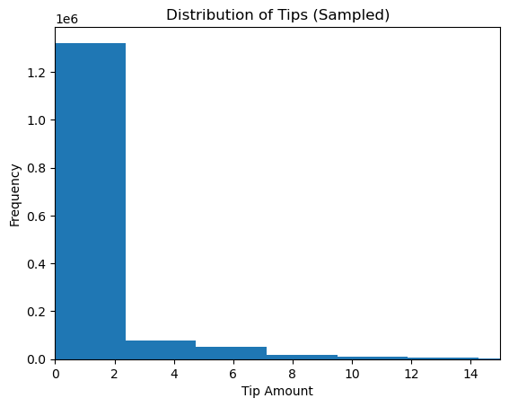
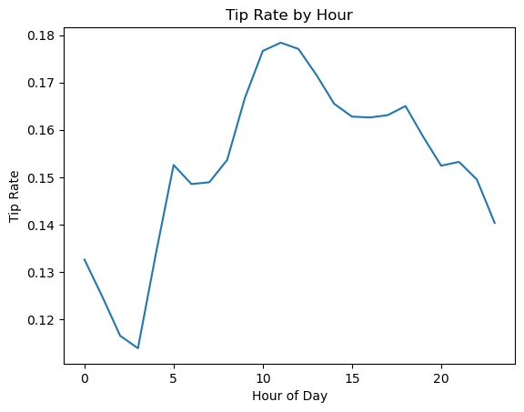
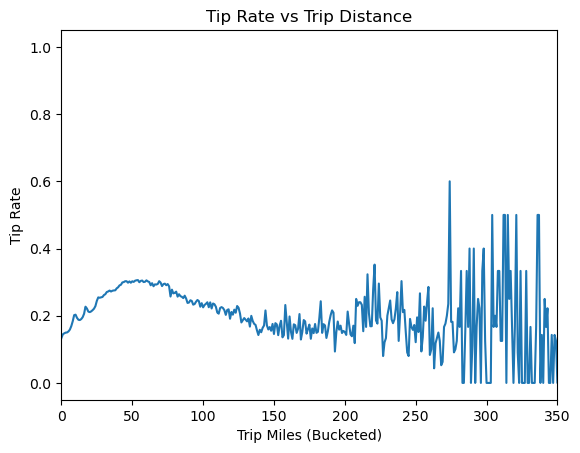
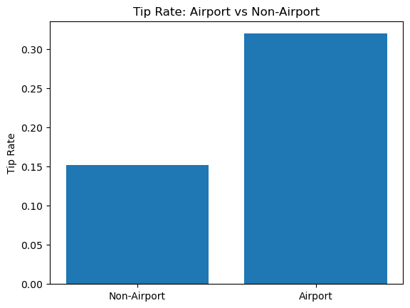
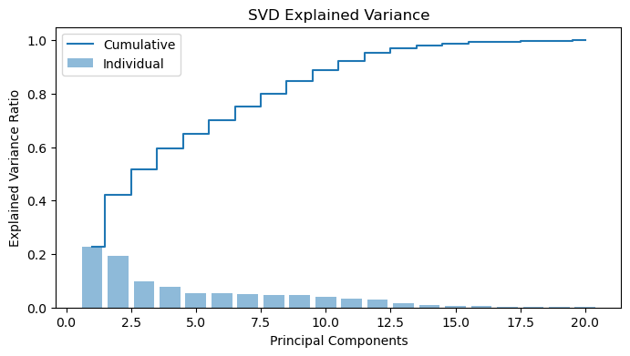
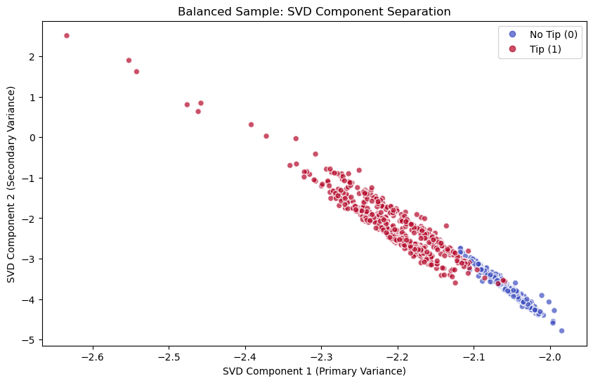

# NYC Uber/Lyft Tip Prediction on Large-Scale Trip Data

- [EDA Notebook](https://github.com/javageek2018/SparkGroupProject/blob/Milestone2/eda_232r.ipynb)
- [First Model Notebook](https://github.com/javageek2018/SparkGroupProject/blob/Milestone3/preprocess_232r.ipynb)
- [Final Model Notebook](https://github.com/javageek2018/SparkGroupProject/blob/Milestone4/final_model_232r.ipynb)

## Introduction

This project focuses on predicting whether a customer will leave a tip for a ride using large-scale trip data. Tipping behavior is influenced by a combination of trip characteristics, passenger behavior, and contextual factors, making it a challenging and meaningful prediction task. Accurately modeling this behavior can provide insights into customer decision-making and inform downstream applications such as driver incentives, pricing strategies, and service optimization.

From a machine learning perspective, this problem involves high-dimensional tabular data with complex relationships between features. Traditional models can struggle to capture these interactions efficiently, especially at scale. To address this, we apply dimensionality reduction using Singular Value Decomposition (SVD) to compress the feature space while preserving important structure.

From a systems perspective, this project requires big data and distributed computing. Processing millions of trip records, performing matrix factorization, and training models would be impractical on a single machine. Using Apache Spark enables scalable data processing and distributed model training.

Dataset can be found here:
https://www.kaggle.com/datasets/jeffsinsel/nyc-fhvhv-data

## Figures



Figure 1: The majority of trips do not include a tip, indicating a clear class imbalance in the dataset. This imbalance increases the difficulty of the prediction task and motivates the use of evaluation metrics such as Precision-Recall AUC, which better reflect performance on the minority class.



Figure 2: Tip values are highly skewed, with most tips concentrated at lower values and a long tail of larger tips. This skewness suggests that predicting exact tip amounts is challenging, motivating the use of a binary classification approach to model tipping behavior.



Figure 3: Tipping behavior varies across the day, with higher tip rates observed during midday and early afternoon hours. This pattern indicates that temporal features play an important role in predicting tipping behavior.



Figure 4: Tip rates tend to increase for short to medium-distance trips and become more variable for longer trips. This suggests that trip distance influences tipping behavior, though the relationship becomes less stable at extreme distances due to fewer observations.



Airport-related trips exhibit significantly higher tipping rates compared to non-airport trips. This highlights the importance of location-based features and suggests differences in passenger behavior depending on trip context.



Figure 6: The first few components capture a large proportion of the total variance, with diminishing returns as more components are added. Approximately 90–95% of the variance is retained within the first set of components, indicating that dimensionality reduction effectively compresses the feature space while preserving most of the underlying structure. This justifies the use of SVD-reduced features for downstream modeling.



Figure 7: Projection of the data onto the first two SVD components reveals partial separation between tipping and non-tipping trips. While the classes are not perfectly separable, distinct clustering patterns emerge, suggesting that the reduced feature space retains meaningful structure relevant to the prediction task. This supports the use of both linear and nonlinear models on the compressed features.

## Methods

### Data Exploration

We begin by exploring the dataset to understand key characteristics of tipping behavior and feature distributions. The analysis focuses on:
	•	distribution of tipping behavior (tipped vs not tipped)
	•	distribution of tip amounts
	•	relationships between tipping and trip attributes (time, distance, location)

We observe that tipping behavior is imbalanced, with a majority of trips not including a tip. Additionally, tip amounts exhibit strong skewness, suggesting challenges in directly modeling tip values.

### Preprocessing

All preprocessing steps are performed using PySpark to ensure scalability.

Key steps include:
	•	cleaning and validating trip-level features
	•	constructing a binary label:
        •	label = 1 if a tip is present
        •	label = 0 otherwise
	•	assembling features into a vector column for modeling
	•	handling class imbalance using a class_weight column
	•	splitting data into training and testing sets

### Model 1

``` python
Add our python code here
```

As the first distributed model, we trained Random Forest classifiers on the original feature space to predict whether a trip would result in a tip. Random Forest was chosen as a strong baseline because it can capture nonlinear feature interactions while remaining scalable in Spark. 

To address class imbalance, inverse-frequency class weights were applied during training. Two Random Forest configurations were evaluated to study how tree depth and ensemble size affected performance.

### Model 2

``` python
Add our python code here
```

After establishing a baseline with Random Forest on the original feature space, we introduced Singular Value Decomposition (SVD) as a dimensionality reduction step. The goal was to compress the feature space, reduce redundancy, and test whether a lower-dimensional representation could retain enough information for accurate tipping prediction. The reduced features were then used in downstream classifiers, primarily Logistic Regression, with additional experiments using XGBoost on sampled data when computationally feasible.

## Results

## Discussion

## Conclusion

## Statement of Collaboration

**Luigi:** Created Exploratory Data Analysis visualizations, helped create data preprocessing pipeline. Helped conduct model tuning for the first and second model. Responsible for writing Introduction, Figures, and helped writing Methods of the final report.
